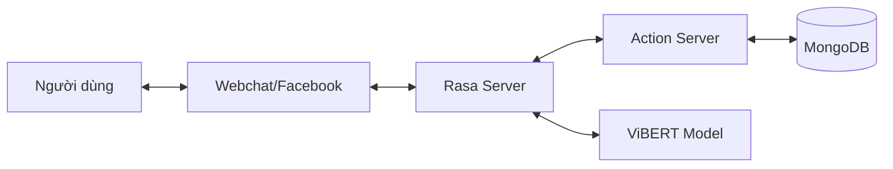

# 🤖 TechShop AI Assistant (Rasa Chatbot)


> **Trợ lý ảo thông minh dành cho thương mại điện tử, chuyên về các sản phẩm công nghệ.**
> Được xây dựng trên nền tảng **Rasa Framework** kết hợp với mô hình ngôn ngữ **ViBERT** (FPT AI) để tối ưu hóa khả năng hiểu tiếng Việt.

---

## � Mục lục

- [Giới thiệu](#-giới-thiệu)
- [Tính năng nổi bật](#-tính-năng-nổi-bật)
- [Công nghệ sử dụng](#-công-nghệ-sử-dụng)
- [Kiến trúc hệ thống](#-kiến-trúc-hệ-thống)
- [Cài đặt & Triển khai](#-cài-đặt--triển-khai)
- [Hướng dẫn sử dụng](#-hướng-dẫn-sử-dụng)
- [Cấu trúc dự án](#-cấu-trúc-dự-án)
- [Đóng góp](#-đóng-góp)

---

## 📝 Giới thiệu

**TechShop Chatbot** không chỉ là một công cụ trả lời tự động, mà là một nhân viên tư vấn ảo toàn diện. Hệ thống có khả năng thấu hiểu ngữ cảnh, ghi nhớ thông tin người dùng và thực hiện các tác vụ phức tạp như so sánh sản phẩm, kiểm tra tồn kho theo thời gian thực và quản lý đơn hàng.

Dự án tập trung vào trải nghiệm người dùng tự nhiên, hỗ trợ đa dạng các cách diễn đạt từ trang trọng đến văn nói hàng ngày (teencode, viết tắt).

---

## 🌟 Tính năng nổi bật

| Tính năng | Mô tả |
|-----------|-------|
| 🛍️ **Tư vấn thông minh** | Gợi ý sản phẩm dựa trên nhu cầu (giá, cấu hình, thương hiệu). So sánh chi tiết giữa các sản phẩm. |
| 🔍 **Tra cứu & Tồn kho** | Kiểm tra thông tin kỹ thuật, giá bán và tình trạng tồn kho tại các chi nhánh theo thời gian thực. |
| 🛒 **Quản lý đơn hàng** | Thêm vào giỏ hàng, cập nhật số lượng, đặt hàng nhanh chóng và tra cứu trạng thái đơn hàng. |
| 💬 **Giao tiếp tự nhiên** | Hỗ trợ Chitchat, chào hỏi theo tên người dùng (Personalized Greeting), xử lý các câu hỏi ngoài phạm vi. |
| 🔧 **Hỗ trợ kỹ thuật** | Giải đáp các thắc mắc thường gặp (FAQ) về bảo hành, đổi trả và lỗi kỹ thuật. |

---

## 🚀 Công nghệ sử dụng

### Core AI & NLP
- **Rasa Open Source 3.x**: Framework nòng cốt cho NLU và Dialogue Management.
- **ViBERT (FPT AI)**: Pre-trained Transformer model giúp xử lý tiếng Việt chính xác cao.
- **DIETClassifier**: Mô hình kiến trúc kép cho cả phân loại ý định và trích xuất thực thể.

### Backend & Database
- **Python 3.8+**: Ngôn ngữ lập trình chính cho Custom Actions.
- **MongoDB**: NoSQL Database lưu trữ thông tin sản phẩm, đơn hàng, người dùng và lịch sử chat.
- **Redis** (Optional): Caching và Lock store cho Rasa.

---

## 🏗️ Kiến trúc hệ thống



---

## 🛠️ Cài đặt & Triển khai

### Yêu cầu tiên quyết
- Python 3.8 - 3.10
- MongoDB đang chạy (Local hoặc Cloud)
- Git

### Các bước cài đặt

1.  **Clone dự án**
    ```bash
    git clone https://github.com/your-repo/TechShop-Ecommerce.git
    cd TechShop-Ecommerce/chatbot-training
    ```

2.  **Thiết lập môi trường ảo**
    ```bash
    python -m venv venv
    # Windows
    venv\Scripts\activate
    # Linux/Mac
    source venv/bin/activate
    ```

3.  **Cài đặt dependencies**
    ```bash
    pip install -r requirements.txt
    ```

4.  **Cấu hình Database**
    Kiểm tra file `utils/database.py` và cập nhật `MONGO_URI` nếu cần thiết.

5.  **Huấn luyện mô hình**
    ```bash
    rasa train
    ```

---

## 💻 Hướng dẫn sử dụng

### Chạy Action Server
Đây là server xử lý logic nghiệp vụ (kết nối DB, tính toán...). Cần chạy ở một terminal riêng.
```bash
rasa run actions
```

### Chạy Chatbot (Interactive Shell)
Để chat trực tiếp với bot trong terminal:
```bash
rasa shell
```

### Chạy API Server
Để tích hợp với Web hoặc Mobile App:
```bash
rasa run --enable-api --cors "*"
```

---

## � Cấu trúc dự án

```
chatbot-training/
├── actions/                 # Chứa logic xử lý (Custom Actions)
│   ├── action_checkstock.py # Logic kiểm tra tồn kho
│   ├── action_order.py      # Logic đặt hàng
│   └── ...
├── data/                    # Dữ liệu huấn luyện
│   ├── nlu/                 # Dữ liệu hiểu ngôn ngữ tự nhiên (Intents)
│   ├── stories.yml          # Kịch bản hội thoại mẫu
│   └── rules.yml            # Các quy tắc hội thoại cố định
├── models/                  # Nơi lưu các model đã train (.tar.gz)
├── utils/                   # Các hàm tiện ích (Database, Format...)
├── config.yml               # Cấu hình NLU Pipeline & Policies
├── domain.yml               # Định nghĩa "thế giới" của bot (Intents, Responses, Slots)
├── credentials.yml          # Cấu hình kết nối (Facebook, Slack, REST...)
└── endpoints.yml            # Cấu hình kết nối Action Server, Tracker Store
```

---

## 🤝 Đóng góp

Chúng tôi rất hoan nghênh mọi đóng góp để cải thiện dự án!

1.  Fork dự án.
2.  Tạo branch tính năng mới (`git checkout -b feature/AmazingFeature`).
3.  Commit thay đổi (`git commit -m 'Add some AmazingFeature'`).
4.  Push lên branch (`git push origin feature/AmazingFeature`).
5.  Tạo Pull Request.

---

## 📄 License

Dự án được phân phối dưới giấy phép **MIT License**. Xem file [LICENSE](LICENSE) để biết thêm chi tiết.

---

**Built with ❤️ by TechShop Team**
